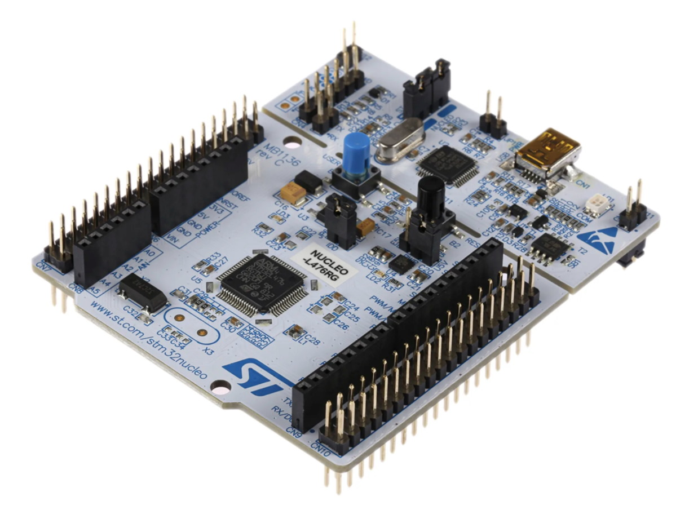

# Nucleo L476RG



| Vendor           | ST Microelectronics  |
| ---------------- | -------------------- |
| Source on GitHub | [stm32/NUCLEO_L476RG](https://github.com/micropython/micropython/tree/master/ports/stm32/boards/NUCLEO_L476RG)  |

## Installation instructions

### STM32 via ST-Link

Nucleo and Discovery boards typically include a built-in ST-Link programmer.

A `.bin` or `.hex` file can be flashed using `st-flash`.

```sh
# Optional erase to clear existing filesystem.
st-flash erase

# Flash .bin
st-flash write firmware.bin 0x08000000
# or, flash .hex
st-flash --format ihex write firmware.hex
```

A .hex file can be flashed using STM32 Cube Programmer.

```sh
STM32_Programmer.sh -c port=SWD -d firmware.hex -hardRst
```

### STM32 via DFU

Boards with USB support can also be programmed via the ST DFU bootloader, using e.g. `dfu-util` or `pydfu.py`.

To enter the bootloader the `BOOT0` pin can be connected to `VCC` during reset, or you can use `machine.bootloader()` from the MicroPython REPL.

```sh
dfu-util --alt 0 -D firmware.dfu
```

## Firmware

### Releases

* v1.19.1 (2022-06-18) [.dfu](./NUCLEO_L476RG-20220618-v1.19.1.dfu) [.hex](./NUCLEO_L476RG-20220618-v1.19.1.hex)
* v1.18 (2022-01-17) [.dfu](./NUCLEO_L476RG-20220117-v1.18.dfu) [.hex](./NUCLEO_L476RG-20220117-v1.18.hex)
