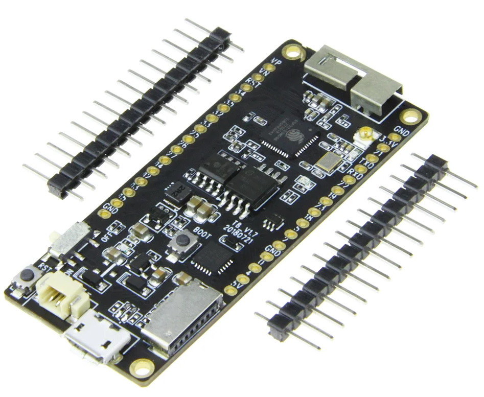

# ESP32 with SPIRAM



| Vendor           | Espressif              |
| ---------------- | ---------------------- |
| Features         | BLE, SPIRAM, WiFi      |
| Source on GitHub | [esp32/GENERIC_SPIRAM](../libs/micropython/ports/esp32/boards/GENERIC_SPIRAM/)  |
| More info        | [Website](https://www.espressif.com/en/products/modules)  |

The following files are daily firmware for ESP32-based boards with external SPIRAM (also known as PSRAM).

This firmware is compiled using ESP-IDF v4.x. Some older releases are also provided that are compiled with ESP-IDF v3.x.

## Installation instructions

### STM32 via ST-Link

Program your board using the `esptool.py` program, found [here](../libs/esptool/).

If you are putting MicroPython on your board for the first time then you should first erase the entire flash using:

```sh
esptool.py --chip esp32 --port /dev/ttyUSB0 erase_flash
```

From then on program the firmware starting at address 0x1000:

```sh
esptool.py --chip esp32 --port /dev/ttyUSB0 --baud 460800 write_flash -z 0x1000 esp32-20190125-v1.10.bin
```

## Firmware

### Releases

* v1.19.1 (2022-06-18) [.bin](./esp32spiram-20220618-v1.19.1.bin) [.elf](./esp32spiram-20220618-v1.19.1.elf) [.map](./esp32spiram-20220618-v1.19.1.map)
* v1.18 (2022-01-17) [.bin](./esp32spiram-20220117-v1.18.bin) [.elf](./esp32spiram-20220117-v1.18.elf) [.map](./esp32spiram-20220117-v1.18.map)
